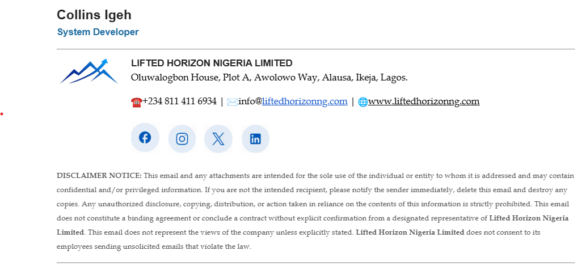

# Email Signature Lifted Horizon

The HTML for Lifted Horizon company-wide email signature.

## Setup Process

The process of setting up an email signature using this theme is outlined in the following steps:

**Note:** It is assumed thay you already have your email account created on webmail.

### Step 1

Log into your email account and click on **Settings**

### Step 2

Select **Identities**

### Step 3

Select the identity you want to create a signature for. *You will find only one identity there by default EXCEPT you have created multiple identities before now*

This will display the form to enter the settings details and to create the email signature.

### Step 4

Fill out the form fields with the appropriate settings details. *The fields here are: Display Name, Email, Organization, Reply-To, Bcc, and Set default. I will usually fill all except the Bcc and turn on the "Set default" field.

### Step 5

Open the file **Email Signature - Lifted Horizon.txt** and copy the content. *You will paste it as the Email Signature in the nest step.*

### Step 6

Change the Email Signature form field to "source code" by click on the **<>** (the source code icon). *If you do not see the source code icon, expand the options by click on the "3 dots" more options icon. This will display more options including the source code icon for you to choose.*

**Note** This action will open the source code pop-up/dialog box.

### Step 7

Paste the code you copied in step 5 above and click on save. *Once saved, you will see the end-user preview. And can now change the signature information like name, job tile etc.*

### Step 8

Click on the the name and change it to your name. Click on the the job description/title and change it to yours. Click on anyother thing you wish to change and change it to yours. Then click on the save button to save it.

CONGRATULATIONS! You have now set-up email signature.
